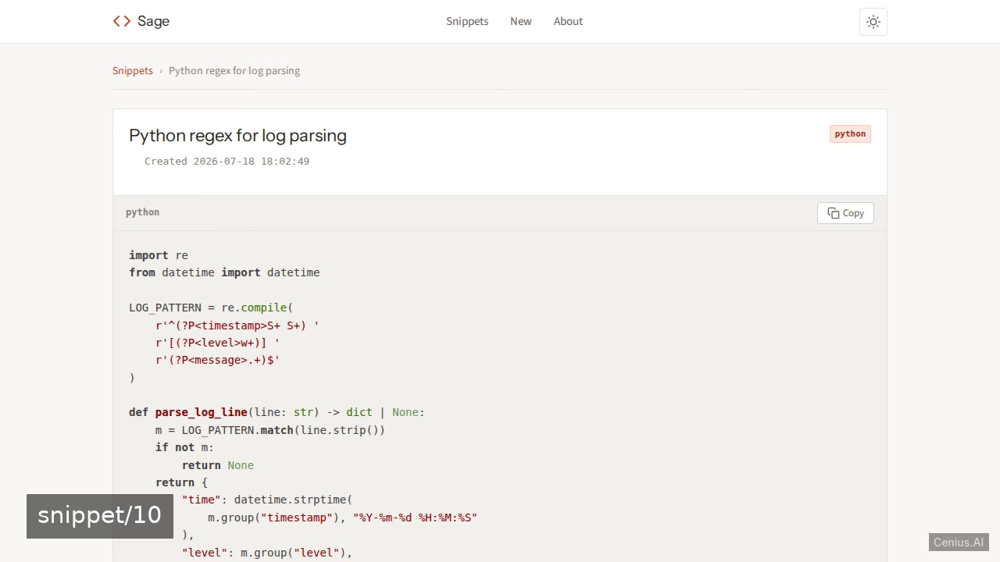
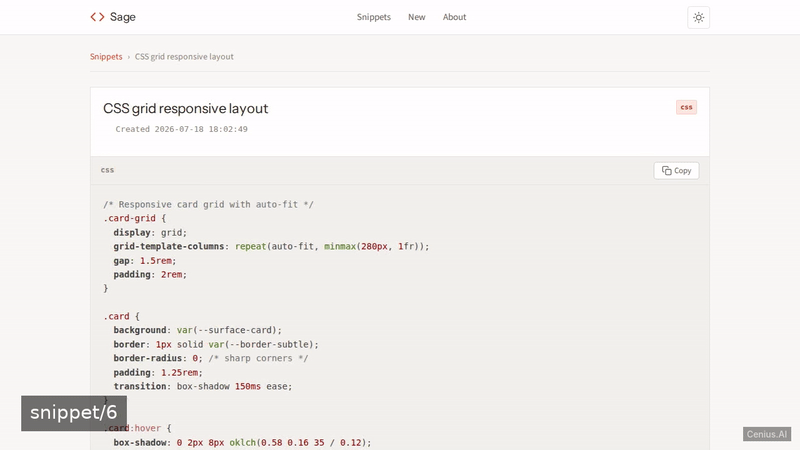
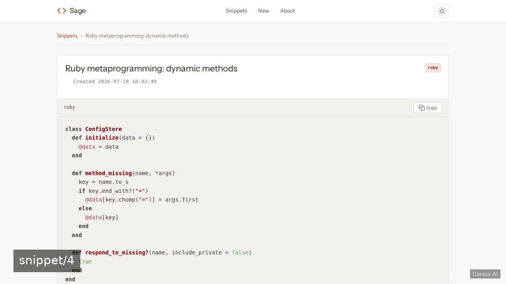
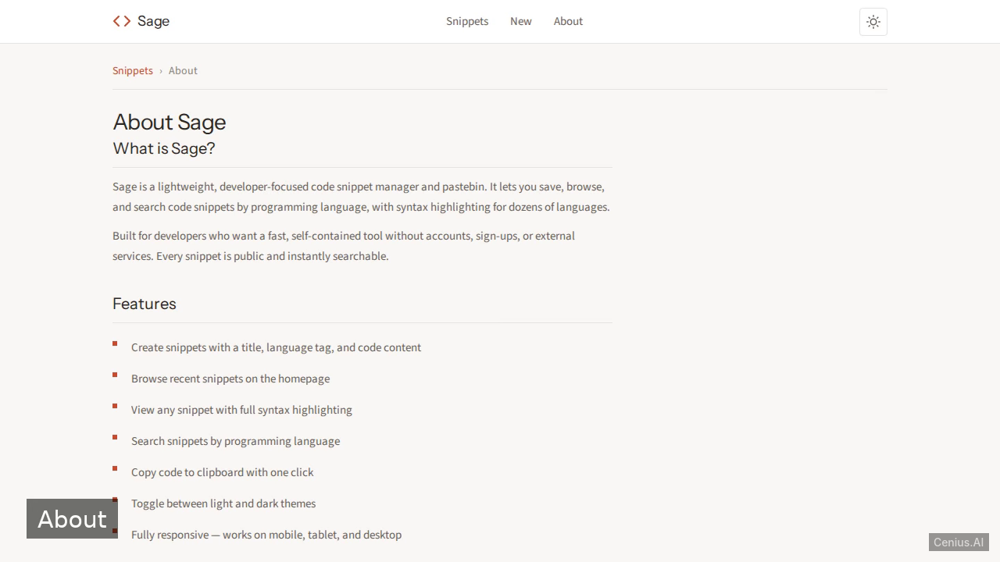

# Sage — Developer's Code Snippet Manager — Crystal pet knowledge base app reference implementation

**Sage — Developer's Code Snippet Manager** is a free, open-source pet knowledge base app built with Crystal. Sage is a public pastebin for developers to quickly share code snippets without accounts. Run it locally, deploy it as a self-hosted knowledge base app, or [remix it on cenius.ai](https://cenius.ai/marketplace/p/sage-developer-s-code-snippet-manager?ref=gh&utm_campaign=sage-developer-s-code-snippet-manager-crystal) to make it your own — the whole application (code, design, seeded demo data) ships in this repository under the Apache-2.0 license.

[](LICENSE)  [](https://cenius.ai)

[](https://cenius.ai/marketplace/p/sage-developer-s-code-snippet-manager?ref=gh&utm_campaign=sage-developer-s-code-snippet-manager-crystal)

> **▶ [Open & edit in cenius.ai](https://cenius.ai/marketplace/p/sage-developer-s-code-snippet-manager?ref=gh&utm_campaign=sage-developer-s-code-snippet-manager-crystal)** — one click to an editable workspace: describe changes in plain English, get an instant preview, one-click deploy and host. Modifications made on the platform come with full rebrand & relicense rights.

_Local clone? See [Quick start](#quick-start) below. cenius.ai is the zero-setup path._

## Demo





▶ **[Watch the full demo video](https://cenius.ai/marketplace/p/sage-developer-s-code-snippet-manager?ref=gh&utm_campaign=sage-developer-s-code-snippet-manager-crystal)** — the complete walkthrough, playing on the project's cenius.ai page · [MP4 file](.github/media/demo.mp4)

## Screenshots

  

## Features

- Create public snippet
- View a snippet
- List recent snippets
- Search by language
- Light/Dark theme toggle
- Seeded demo data
- Responsive design
- Syntax highlighting

## Quick start

```bash
./install.sh   # installs dependencies + seeds demo data
```

See [`INSTALL.md`](INSTALL.md) for full setup and usage instructions.

## Usage guide

### Homepage (`/`)

The homepage shows the most recent snippets in a responsive card grid. Each card
displays the title, language badge, a preview of the first three lines, and the
creation date.

A **language filter** at the top lets you search by programming language.

### Create a Snippet (`/new`)

Click **New** in the header (or the **+ New Snippet** button) to open the
creation form. Fill in:

- **Title** — a short description (e.g. "Quick sort in Python")
- **Language** — select from the dropdown (20+ languages supported)
- **Code** — paste your code into the textarea

Click **Save Snippet** to create it. You'll be redirected to the snippet's
detail page.

### View a Snippet (`/snippet/:id`)

Each snippet has its own page showing:

- Title and language badge
- Creation timestamp
- Full code block with syntax highlighting
- **Copy** button to copy the code to clipboard

Click **Back to all snippets** or use the breadcrumb to return to the list.

### Search (`/search?lang=...`)

Use the language filter on the homepage or search page. Select a language
and click **Search**. Only snippets matching that language (case-insensitive)
are shown.

Clear the filter by selecting "All languages" and searching again.

### Theme Toggle

Click the **sun/moon icon** in the header to switch between light and dark
themes. Your preference is saved in `localStorage` and restored on your next
visit.

### Supported Languages

bash, c, crystal, css, dockerfile, elixir, go, html, java, javascript,
json, kotlin, lua, markdown, php, python, ruby, rust, sql, swift,
typescript, yaml, text

_Full guide: [`USAGE.md`](USAGE.md)_

## Architecture

Crystal application, delivered as a complete, runnable project (267 files). Top-level layout: `bin/`, `data/`, `lib/`, `public/`, `src/`, `views/`. `install.sh` provisions dependencies and seeds demo data, so the app boots with something to show. Setup details live in [`INSTALL.md`](INSTALL.md).

## FAQ

### How do I run Sage — Developer's Code Snippet Manager on my own server?

Everything you need ships in this repo: clone it, run `./install.sh` to install dependencies and seed demo data, then follow [`INSTALL.md`](INSTALL.md) to start it. No external services required.

### Can I use Sage — Developer's Code Snippet Manager in a commercial project?

Yes. The code is Apache-2.0-licensed — use it, modify it, and ship it commercially. See [LICENSE](LICENSE).

### How do I make Sage — Developer's Code Snippet Manager my own brand?

Yes — and the easiest way is [remixing it on cenius.ai](https://cenius.ai/marketplace/p/sage-developer-s-code-snippet-manager?ref=gh&utm_campaign=sage-developer-s-code-snippet-manager-crystal): modifications made on the platform come with full rebrand and relicense rights over your derivative.

### Can I change Sage — Developer's Code Snippet Manager without writing code?

Open it on [cenius.ai](https://cenius.ai/marketplace/p/sage-developer-s-code-snippet-manager?ref=gh&utm_campaign=sage-developer-s-code-snippet-manager-crystal) and describe the changes you want in plain English — the platform modifies the app and gives you a new, downloadable build.

### What is Sage — Developer's Code Snippet Manager built with?

The app is built with Crystal. What you see in this repo is the full production source, demo data included. Highlights include view a snippet.

## License & rebranding

Released under the [Apache License 2.0](LICENSE) (© 2026 Cenius AI) — free for personal and commercial use. The Cenius name/logo are trademarks (see NOTICE).

**Need a customized version?** [Remix this app on cenius.ai](https://cenius.ai/marketplace/p/sage-developer-s-code-snippet-manager?ref=gh&utm_campaign=sage-developer-s-code-snippet-manager-crystal) — modifications made on the platform come with **full rebrand & relicense rights** over your derivative.

## Built with cenius.ai

This entire application — code, design, seeded demo data — was generated on **[cenius.ai](https://cenius.ai)** from a plain-English description.

- 🚀 [Build your own app on cenius.ai](https://cenius.ai)
- 🎛️ [Remix Sage — Developer's Code Snippet Manager on the marketplace](https://cenius.ai/marketplace/p/sage-developer-s-code-snippet-manager?ref=gh&utm_campaign=sage-developer-s-code-snippet-manager-crystal) — open it in a workspace, prompt for changes, and ship your own version.

More open-source apps: [the Cenius-ai catalog](https://github.com/Cenius-ai) · [showcase index](https://github.com/Cenius-ai/showcase)
